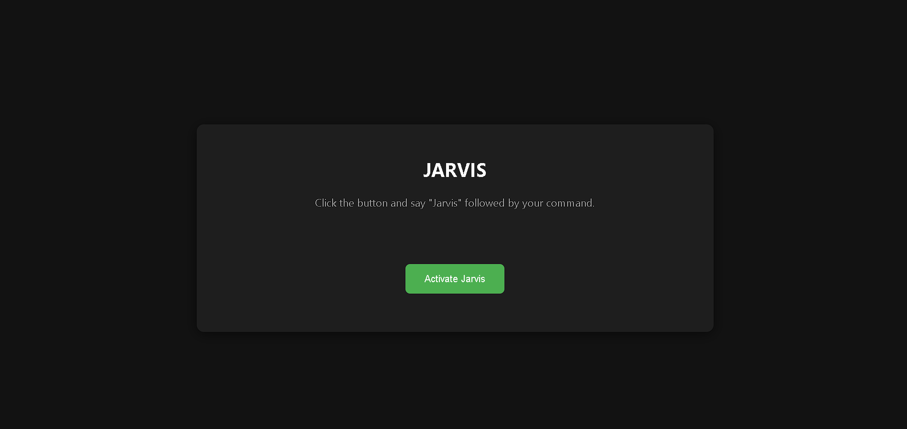

# JARVIS - A Web-Based Voice Assistant

A web-based, voice-activated assistant powered by Python, Flask, and the Google Gemini API.

    

## 🚀 About The Project

This is a web-based voice assistant, inspired by JARVIS, that runs entirely in your browser. It uses the Web Speech API for voice recognition and speech synthesis. The frontend is hosted on GitHub Pages, and it communicates with a Python Flask backend deployed on Vercel to process complex queries using the Google Gemini API and fetch news from the NewsAPI.

# Features ✨

- Voice Commands: Control the assistant with your voice.
- Web Browsing: Open popular websites like YouTube, Google, and social media platforms.
- Web Search: Perform Google searches directly by voice.
- Music Playback: Play songs from a predefined library on YouTube.
- Latest News: Get the top 5 latest news headlines from the US, which are spoken aloud and displayed on the screen.
- AI-Powered Conversations: For commands that are not hard-coded, the assistant uses the Google Gemini API to generate intelligent and relevant responses.
- Client-Side Logic: Most simple commands (like opening websites) are handled directly in the browser for a fast response.

# Tech Stack 🛠️

- Frontend:
    1. HTML5
    2. CSS3
    3. JavaScript (Vanilla)
    4. Web Speech API (for voice recognition and synthesis)

- Backend:
    1. Python 3
    2. Flask (for creating the API)
    3. Google Generative AI API (Gemini)
    4. NewsAPI

- Deployment:
    1. Frontend: GitHub Pages
    2. Backend: Vercel

# Architecture 🏗️

The application uses a decoupled frontend-backend architecture:

- The Frontend, a static site (HTML, CSS, JS), is hosted on GitHub Pages. It captures voice commands from the user.
Simple commands (e.g., "Jarvis, open YouTube") are processed directly in the browser using JavaScript.
For complex queries (e.g., "Jarvis, what is the capital of France?") or news requests, the frontend sends a POST request to the backend API.

- The Backend, a Flask application hosted on Vercel, receives the request. It processes the query using the Google Gemini API or fetches data from the NewsAPI.
The backend sends the structured response (text and/or data) back to the frontend in JSON format.
The frontend receives the JSON response, speaks the answer using the Web Speech API, and displays the information on the page.

# Local Setup and Installation ⚙️

To run this project on your local machine, follow these steps.

- Prerequisites: 
    1. Python 3.8 or higher
    2. A modern web browser that supports the Web Speech API (e.g., Chrome, Edge)
    3. API keys for:
        1. NewsAPI
        2. Google AI Studio (Gemini)
    4. Backend (Flask API)

- Clone the repository:

> Bash  
    > git clone https://github.com/bodhit-kukra/Jarvis.git  
    > cd Jarvis  

- Create and activate a virtual environment:

> Bash  
> On Windows  
    > python -m venv venv   
    > .\venv\Scripts\activate   

> On macOS/Linux  
    > python3 -m venv venv  
    > source venv/bin/activate  

- Install the required Python packages:

> Bash  
    > pip install -r requirements.txt

- Create a .env file in the root directory and add your API keys:
    1. NEWS_API_KEY="YOUR_NEWS_API_KEY"
    2. GOOGLE_API_KEY="YOUR_GOOGLE_API_KEY"

- Run the Flask server:
> Bash  
    > python app.py  
The backend server will now be running at http://127.0.0.1:5000.

> Frontend  
> Before running the frontend, open script.js and update the vercelApiUrl variable to point to your local Flask server for testing:

> JavaScript  
> const vercelApiUrl = "http://127.0.0.1:5000/api/response";

Simply open the index.html file in your web browser.

# How to Use 🎤

1. Open the web page.
2. Click the "Activate Jarvis" button.
3. Your browser will ask for microphone permission. Please allow it.
4. Start your command with the wake word "Jarvis".

- Example Commands:
    1. "Jarvis, open YouTube"
    2. "Jarvis, how are you?"
    3. "Jarvis, play skyfall"
    4. "Jarvis, what are the latest news headlines?"
    5. "Jarvis, explain quantum computing in simple terms"

# Live Demo 🚀

You can try out the live version of the application here:

https://bodhit-kukra.github.io/Jarvis/